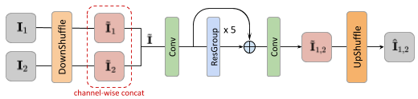
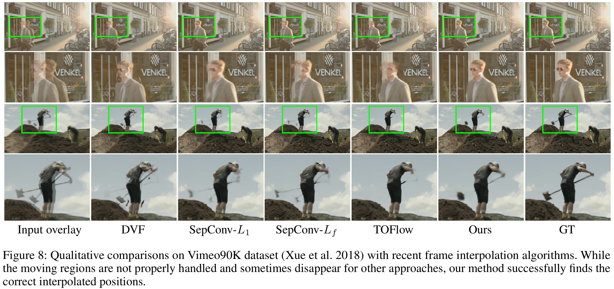

# Channel Attention Is All You Need for Video Frame Interpolation

#### Myungsub Choi, Heewon Kim, Bohyung Han, Ning Xu, Kyoung Mu Lee

#### 2nd place in [[AIM 2019 ICCV Workshop](http://www.vision.ee.ethz.ch/aim19/)] - Video Temporal Super-Resolution Challenge

[Project](https://myungsub.github.io/CAIN) | [Paper-AAAI](https://aaai.org/ojs/index.php/AAAI/article/view/6693/6547) (Download the paper [[here](https://www.dropbox.com/s/b62wnroqdd5lhfc/AAAI-ChoiM.4773.pdf?dl=0)] in case the AAAI link is broken) | [Poster](https://www.dropbox.com/s/7lxwka16qkuacvh/AAAI-ChoiM.4773.pdf)

<a href="https://aaai.org/Papers/AAAI/2020GB/AAAI-ChoiM.4773.pdf" rel="Video"></a>
<a href="https://www.dropbox.com/s/7lxwka16qkuacvh/AAAI-ChoiM.4773.pdf" rel="Poster"><embed src="./figures/CAIN_poster.pdf" alt="Poster" width="20%"></a>


## Directory Structure

``` text
project
│   README.md
|   run.sh - main script to train CAIN model
|   run_noca.sh - script to train CAIN_NoCA model
|   test_custom.sh - script to run interpolation on custom dataset
|   eval.sh - script to evaluate on SNU-FILM benchmark
|   main.py - main file to run train/val
|   config.py - check & change training/testing configurations here
|   loss.py - defines different loss functions
|   utils.py - misc.
└───model
│   │   common.py
│   │   cain.py - main model
|   |   cain_noca.py - model without channel attention
|   |   cain_encdec.py - model with additional encoder-decoder
└───data - implements dataloaders for each dataset
│   |   vimeo90k.py - main training / testing dataset
|   |   video.py - custom data for testing
│   └───symbolic links to each dataset
|       | ...
```

## Dependencies

Current version is tested on:

- Ubuntu 18.04
- Python==3.7.5
- numpy==1.17
- [PyTorch](http://pytorch.org/)==1.3.1, torchvision==0.4.2, cudatoolkit==10.1
- tensorboard==2.0.0 (If you want training logs)
- opencv==3.4.2
- tqdm==4.39.0

``` text
# Easy installation (using Anaconda environment)
conda create -n cain
conda activate cain
conda install python=3.7
conda install pip numpy
conda install pytorch torchvision cudatoolkit=10.1 -c pytorch
conda install tqdm opencv tensorboard
```

## Model

<center></center>

## Dataset Preparation

- We use **[Vimeo90K Triplet dataset](http://toflow.csail.mit.edu/)** for training + testing.
  - After downloading the full dataset, make symbolic links in `data/` folder : 
    - `ln -s /path/to/vimeo_triplet_data/ ./data/vimeo_triplet`
  - Then you're done!
- For more thorough evaluation, we built **[SNU-FILM (SNU Frame Interpolation with Large Motion)](https://myungsub.github.io/CAIN)** benchmark.
  - Download links can be found in the [project page](https://myungsub.github.io/CAIN).
  - Also make symbolic links after download :
    - `ln -s /path/to/SNU-FILM_data/ ./data/SNU-FILM`
  - Done!

## Usage

#### Training / Testing with Vimeo90K dataset
- First make symbolic links in `data/` folder : `ln -s /path/to/vimeo_triplet_data/ ./data/vimeo_triplet`
  - [Vimeo90K dataset](http://toflow.csail.mit.edu/)
- For training: `CUDA_VISIBLE_DEVICES=0 python main.py --exp_name EXPNAME --batch_size 16 --test_batch_size 16 --dataset vimeo90k --model cain --loss 1*L1 --max_epoch 200 --lr 0.0002`
- Or, just run `./run.sh`
- For testing performance on Vimeo90K dataset, just add `--mode test` option
- For testing on SNU-FILM dataset, run `./eval.sh`
  - Testing mode (choose from ['easy', 'medium', 'hard', 'extreme']) can be modified by changing `--test_mode` option in `eval.sh`.

#### Interpolating with custom video
- Download pretrained models from [[Here](https://www.dropbox.com/s/y1xf46m2cbwk7yf/pretrained_cain.pth?dl=0)]
- Prepare frame sequences in `data/frame_seq`
- run `test_custom.sh`

## Results

<center></center>

### Video

<a href="https://www.dropbox.com/s/es2geeg26wwgezk/demo_combined_hires.mp4" rel="Video"></a>

## Citation

If you find this code useful for your research, please consider citing the following paper:

``` text
@inproceedings{choi2020cain,
    author = {Choi, Myungsub and Kim, Heewon and Han, Bohyung and Xu, Ning and Lee, Kyoung Mu},
    title = {Channel Attention Is All You Need for Video Frame Interpolation},
    booktitle = {AAAI},
    year = {2020}
}
```

## Acknowledgement

Many parts of this code is adapted from:

- [EDSR-Pytorch](https://github.com/thstkdgus35/EDSR-PyTorch)
- [RCAN](https://github.com/yulunzhang/RCAN)

We thank the authors for sharing codes for their great works.
