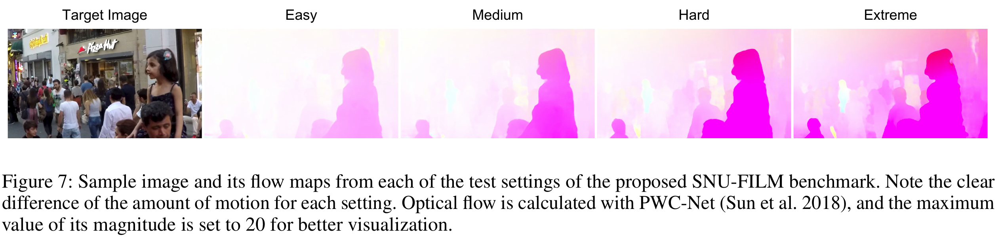

#### [Myungsub Choi](https://myungsub.github.io), [Heewon Kim](https://scholar.google.com/citations?user=B1Yuz3gAAAAJ&hl=en), [Bohyung Han](https://cv.snu.ac.kr/index.php/~bhhan/), [Ning Xu](https://www.linkedin.com/in/ningxu01/), [Kyoung Mu Lee](https://cv.snu.ac.kr/index.php/~kmlee/)

#### 2nd place in [[AIM 2019 ICCV Workshop](http://www.vision.ee.ethz.ch/aim19/)] - Video Temporal Super-Resolution Challenge

[Project](https://myungsub.github.io/CAIN) | [Paper-AAAI](https://aaai.org/Papers/AAAI/2020GB/AAAI-ChoiM.4773.pdf) (Download the paper [[here](https://www.dropbox.com/s/b62wnroqdd5lhfc/AAAI-ChoiM.4773.pdf?dl=0)] in case the AAAI link is broken) | [Poster](https://www.dropbox.com/s/7lxwka16qkuacvh/AAAI-ChoiM.4773.pdf)

<a href="https://aaai.org/Papers/AAAI/2020GB/AAAI-ChoiM.4773.pdf" rel="Video"></a>

## Abstract

Prevailing video frame interpolation techniques rely heavily on optical flow estimation and require additional model complexity and computational cost; it is also susceptible to error propagation in challenging scenarios with large motion and heavy occlusion.
To alleviate the limitation, we propose a simple but effective deep neural network for video frame interpolation, which is end-to-end trainable and is free from a motion estimation network component.
Our algorithm employs a special feature reshaping operation, referred to as PixelShuffle, with a channel attention, which replaces the optical flow computation module.
The main idea behind the design is to distribute the information in a feature map into multiple channels and extract motion information by attending the channels for pixel-level frame synthesis.
The model given by this principle turns out to be effective in the presence of challenging motion and occlusion.
We construct a comprehensive evaluation benchmark and demonstrate that the proposed approach achieves outstanding performance compared to the existing models with a component for optical flow computation.

## Model

<center></center>

- Download pretrained CAIN model from [[Here](https://www.dropbox.com/s/y1xf46m2cbwk7yf/pretrained_cain.pth?dl=0)]


## Dataset

- [ [Vimeo90K Triplet dataset](http://toflow.csail.mit.edu/) ]
- **[ SNU-FILM benchmark ]** : SNU Frame Interpolation with Large Motion evaluation benchmark
  - Our benchmark consists of test split of [GOPRO](https://github.com/SeungjunNah/DeepDeblur_release#dataset) dataset + manually collected video sequences from YouTube.
  - The evaluation is 4 different settings: *Easy, Medium, Hard, Extreme*
    - The average motion magnitude increases from *Easy* to *Extreme*
  - Sample image (from GOPRO) and visualizations of its motion magnitude w.r.t. each evaluation setting

<center></center>

### Download

  - Selected frame triplets for evaluation: [[Download link](https://www.dropbox.com/s/2zmnzsquv5ounvq/eval_modes.zip?dl=0)]
  - All RGB frames: [[Download link](https://www.dropbox.com/s/32wpcpt5izkhoh8/snufilm-test.zip?dl=0)]

## Results

<center></center>

### Video

<a href="https://www.dropbox.com/s/es2geeg26wwgezk/demo_combined_hires.mp4" rel="Video"></a>

## Citation

If you find this code useful for your research, please consider citing the following paper:

``` text
@inproceedings{choi2020cain,
    author = {Choi, Myungsub and Kim, Heewon and Han, Bohyung and Xu, Ning and Lee, Kyoung Mu},
    title = {Channel Attention Is All You Need for Video Frame Interpolation},
    booktitle = {AAAI},
    year = {2020}
}
```

## Acknowledgement

Many parts of this code is adapted from:

- [EDSR-Pytorch](https://github.com/thstkdgus35/EDSR-PyTorch)
- [RCAN](https://github.com/yulunzhang/RCAN)

We thank the authors for sharing codes for their great works.

---
For further questions, please contact [@myungsub](https://myungsub.github.io))
